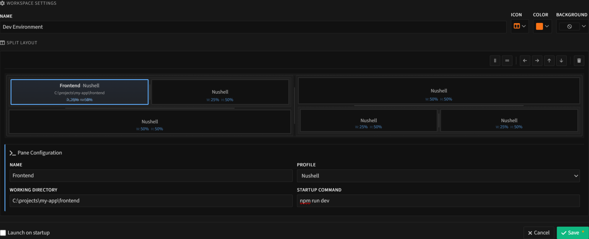

# TabbySpaces

Visual workspace editor for [Tabby](https://tabby.sh). Create split-layout terminal workspaces without touching config files.


## Features

- **Visual split editor** - Design layouts inline, not in modal dialogs. Split horizontally, vertically, nest to any depth
- **Layout toolbar** - Select a pane, then split, add adjacent panes, or delete with toolbar buttons
- **Per-pane configuration** - Set profile, working directory, and startup command for each pane
- **One-click launch** - Open workspaces instantly from the toolbar dropdown
- **Launch on startup** - Auto-open multiple workspaces when Tabby starts
- **Any shell** - Works with Bash, Zsh, PowerShell, Nushell, cmd, WSL, and any other shell Tabby supports

## About this project

This plugin was written 100% by [Claude Code](https://claude.ai/code).

Igor Halilovic had the idea and provided product direction. He hates Angular so much (19 years of web dev, wrote his own TypeScript framework) that he didn't look at this code. Not once. He told Claude Code what he wanted, Claude Code built it.

Human provides the *what* and *why*. AI handles the *how*.

Here's the fun part: to test this plugin, we built [tabby-mcp](https://github.com/halilc4/tabby-mcp) - an MCP server that lets Claude Code interact with Tabby via CDP. So the AI that built TabbySpaces can now test it too. Full circle.

## Install

**From Tabby Plugin Manager:**
Settings > Plugins > Search "tabbyspaces" > Install

**Manual:**
```bash
cd ~/.config/tabby/plugins  # or %APPDATA%\tabby\plugins on Windows
npm install tabby-tabbyspaces
```

Restart Tabby after installation.

## Quick Start

1. **Open settings** - Settings > TabbySpaces
2. **Create workspace** - Click "New Workspace", name it
3. **Design layout** - Click a pane to select it, use toolbar to split (horizontal/vertical)
4. **Configure panes** - Click a pane (or use its context menu) to set profile, cwd, startup command
5. **Save and launch** - Save changes, then click "Open" or use the toolbar dropdown



## Roadmap

- Hotkey support for quick workspace switching
- Pane presets (saved configurations for quick adding)
- Resize panes in editor (adjust split ratios)
- Drag and drop panes (reorganize layout by dragging)

## Tech

- Angular 15 (Tabby's framework)
- TypeScript 4.9
- Webpack 5
- Pug templates, SCSS styles

## Community

- [Discussions](https://github.com/halilc4/tabbyspaces/discussions) - Questions, ideas, show your setup
- [Issues](https://github.com/halilc4/tabbyspaces/issues) - Bug reports

## Contributing

PRs welcome! See [CONTRIBUTING.md](CONTRIBUTING.md) for setup instructions.

All PRs go to the `dev` branch. CI checks the build automatically.

## License

MIT
