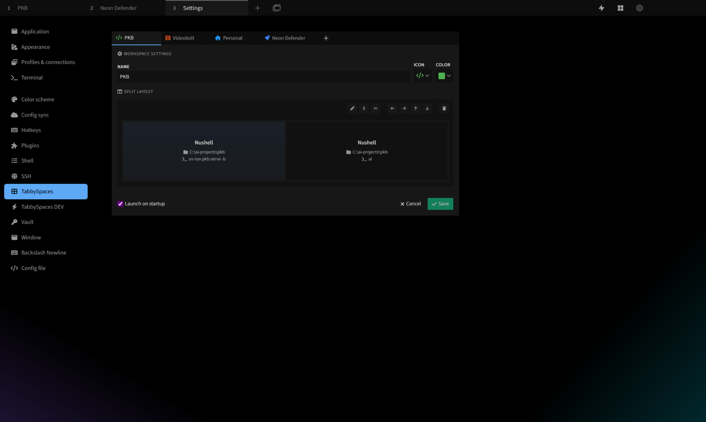
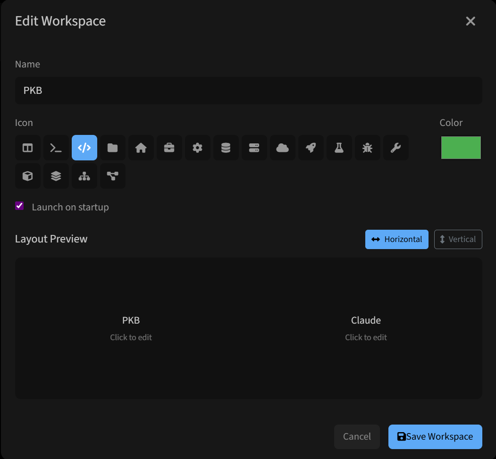
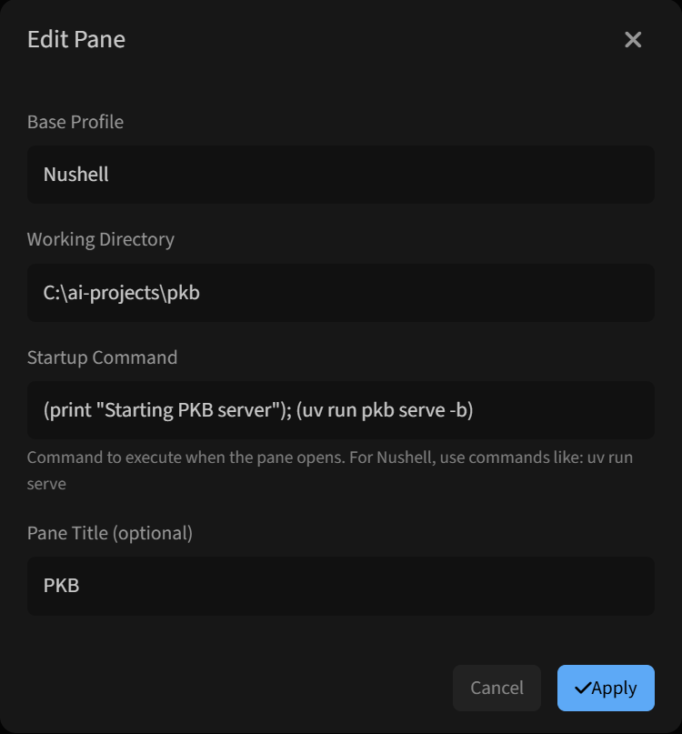

# TabbySpaces

Visual workspace editor for [Tabby](https://tabby.sh). Create split-layout terminal workspaces without touching config files.



## What it does

- Visual editor for split layouts (horizontal/vertical, nested, any depth)
- Per-pane configuration: profile, working directory, startup command, title
- One-click workspace launch from toolbar
- Launch on startup (auto-open workspaces when Tabby starts)
- Works with any shell (Bash, Zsh, PowerShell, Nushell, etc.)

## About this project

This plugin was written 100% by [Claude Code](https://claude.ai/code).

Igor Halilović had the idea and provided product direction. He hates Angular so much (19 years of web dev, wrote his own TypeScript framework) that he didn't look at this code. Not once. He told Claude Code what he wanted, Claude Code built it.

Human provides the *what* and *why*. AI handles the *how*.

## Install

**From Tabby Plugin Manager:**
Settings → Plugins → Search "tabbyspaces" → Install

**Manual:**
```bash
cd ~/.config/tabby/plugins  # or %APPDATA%\tabby\plugins on Windows
npm install tabby-tabbyspaces
```

Restart Tabby after installation.

## Usage

1. Open Settings → TabbySpaces
2. Create a workspace
3. Design your split layout visually
4. Configure each pane (profile, cwd, startup command)
5. Save and launch from the toolbar

### Workspace editor



### Pane configuration



## Roadmap

- Hotkey support for quick workspace switching
- Pane presets (saved configurations for quick adding)
- Resize panes in editor (adjust split ratios)
- Drag and drop panes (reorganize layout by dragging)

## Tech

- Angular 15 (Tabby's framework)
- TypeScript 4.9
- Webpack 5
- Pug templates, SCSS styles

## License

MIT
